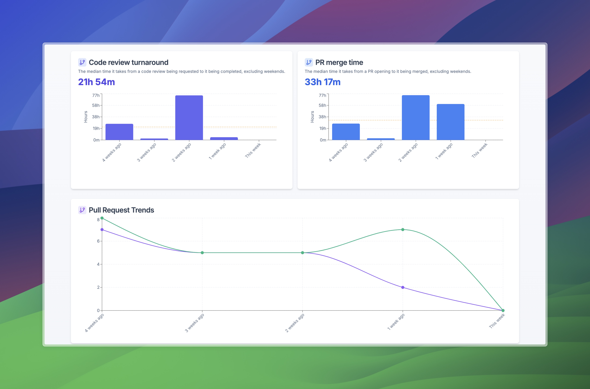

# CodeVigil

CodeVigil is a modern web application for monitoring and analyzing software development metrics. It provides real-time insights into pull request metrics, code review times, and development trends to help teams improve their workflow and productivity.

## Technology Stack

- **Frontend**: Next.js 13, React, TypeScript
- **UI Components**: Shadcn UI, Radix UI primitives
- **Styling**: Tailwind CSS
- **Charting**: Recharts

## Screenshots

### Dashboard View


### Metrics Overview


### Repository View


## Getting Started

### Prerequisites

- Node.js 16.8 or later
- npm or yarn

### Installation

1. Clone the repository:
```bash
git clone https://github.com/parthmodi152/codevigil-dashboard.git
cd codevigil-dashboard
```

2. Install dependencies:
```bash
npm install
# or
yarn install
```

3. Run the development server:
```bash
npm run dev
# or
yarn dev
```

4. Open [http://localhost:3000](http://localhost:3000) in your browser to see the application.

## Build for Production

```bash
npm run build
npm run start
# or
yarn build
yarn start
```

## Project Structure

- `/app`: Next.js app directory (pages and layouts)
  - `/dashboard`: Dashboard page for displaying repository metrics
  - `/add`: Page for adding new repositories to track
- `/components`: Reusable UI components
  - `/dashboard`: Dashboard-specific components (Charts, StatCards, MetricsTable)
  - `/shared`: Shared components used across multiple pages (Footer, TrendIndicator)
  - `/ui`: Base UI components from shadcn/ui
- `/hooks`: Custom React hooks including useMetrics for data fetching and processing
- `/utils`: Utility functions and helpers
  - `/formatters`: Date, time, and trend formatting utilities
- `/public`: Static assets and images
- `/lib`: Library code and third-party integrations

## Contributing

Contributions are welcome! Please feel free to submit a Pull Request.

## License

This project is licensed under the MIT License - see the LICENSE file for details. 